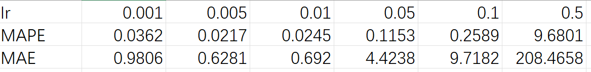

## <center> A股预测实验报告 </center>
### 一、实验目的
- 学习了解深度学习模型的基本框架，包括数据集的划分，模型的搭建，训练，评估等基本步骤。
- 了解并掌握针对时序问题的深度学习模型（如LSTM等）
  
### 二、实验内容
- 给定某股票前 14 个交易日的收盘价，预测下一个交易日的收盘价。最终效果的评价指标为平均绝对百分比误差和平均绝对误差。
- 自己构建一个深度学习模型，使用提供的训练数据（包含五十多支股票前 14 个交易日的收盘价和下一个交易日的收盘价）进行训练，然后利用训练好的模型进行预测。


### 三、实现过程与具体代码
**数据的划分与预处理：**
实验中给定的数据集包含五十多支股票的历史数据，每支股票包含前 14 个交易日的收盘价和下一个交易日的收盘价，我们首先读取该数据集中的数据，然后将每一支股票的前14个数据作为自变量，第十五个数据作为因变量并将其转换为numpy数组方便后续计算。
代码如下：
```python
# 获取文件名
file_name = 'train_data.npy'

# 读取数组
data = np.load(file_name)

# 生成题目所需的训练集合
def generate_data(data):

    # 记录 data 的长度
    n = data.shape[0]

    # 目标是生成可直接用于训练和测试的 x 和 y
    x = []
    y = []

    # 建立 (14 -> 1) 的 x 和 y
    for i in range(15, n):
        x.append(data[i-15:i-1])
        y.append(data[i-1])

    # 转换为 numpy 数组
    x = np.array(x)
    y = np.array(y)

    return x,y

x,y = generate_data(data)
```
接着，我们将数据集划分为训练集、校验集和测试集，其中训练集占70%，测试集占20%，校验集占10%，校验集和测试集用于测试和评估训练得到的模型的效果。
```python
# 生成 train valid test 集合，以供训练所需
def generate_training_data(x, y):
    # 样本总数
    num_samples = x.shape[0]
    # 测试集大小
    num_test = round(num_samples * 0.2)
    # 训练集大小
    num_train = round(num_samples * 0.7)
    # 校验集大小
    num_val = num_samples - num_test - num_train

    # 训练集拥有从 0 起长度为 num_train 的样本
    x_train, y_train = x[:num_train], y[:num_train]
    # 校验集拥有从 num_train 起长度为 num_val 的样本
    x_val, y_val = (
        x[num_train: num_train + num_val],
        y[num_train: num_train + num_val],
    )
    # 测试集拥有尾部 num_test 个样本
    x_test, y_test = x[-num_test:], y[-num_test:]

    # 返回这些集合
    return x_train, y_train, x_val, y_val, x_test, y_test

x_train, y_train, x_val, y_val, x_test, y_test = generate_training_data(x, y)
```
然后，由于我们采用pytorch框架，我们需要将数据集转换为pytorch的数据集，以便于后续训练，即将自变量和因变量都转化为tensor形式并将因变量转化为列向量。
```python
# 获取数据中的 x, y
x,y = generate_data(data)

# 将 x,y 转换乘 tensor ， Pytorch 模型默认的类型是 float32
x = torch.tensor(x)
y = torch.tensor(y)

print(x.shape,y.shape)

# 将 y 转化形状
y = y.view(y.shape[0],1)

print(x.shape,y.shape)
```
接着，由于不同股票的价格差异过大，我们需要对数据进行归一化处理，防止数值大的数据主导模型计算，导致结果失真
```python
from sklearn.preprocessing import MinMaxScaler

# 这个 [0, 300] 是手动的预设值，可以自己更改
scaler = MinMaxScaler().fit(np.array([0, 300]).reshape(-1, 1))
# 对 x, y 进行 minmaxscale
x_scaled = scaler.transform(x.reshape(-1,1)).reshape(-1,14)
y_scaled = scaler.transform(y)

x_scaled = torch.tensor(x_scaled, dtype=torch.float32)
y_scaled = torch.tensor(y_scaled, dtype=torch.float32)
# 处理出训练集，校验集和测试集
x_train, y_train, x_val, y_val, x_test, y_test = generate_training_data(x_scaled, y_scaled)
```
然后，我们自己创建一个dataset并采用pytorch的dataloader来加载数据集，其中dataloader可以自动将数据集分批次加载，每次加载batch_size个数据，保证训练精度的同时减少了显存压力。同时dataloder会将训练数据打乱，防止模型过拟合
```python
# 建立一个自定 Dataset
class MyDataset(torch.utils.data.Dataset):
    def __init__(self, x, y):
        self.x = x
        self.y = y

    def __getitem__(self, item):
        return self.x[item], self.y[item]

    def __len__(self):
        return len(self.x)
# 建立训练数据集、校验数据集和测试数据集
train_data = MyDataset(x_train,y_train)
valid_data = MyDataset(x_val,y_val)
test_data = MyDataset(x_test,y_test)
# 规定批次的大小
batch_size = 32

# 创建对应的 DataLoader
train_iter = torch.utils.data.DataLoader(train_data, batch_size=batch_size, shuffle=True)

# 校验集和测试集的 shuffle 是没有必要的，因为每次都会全部跑一遍
valid_iter = torch.utils.data.DataLoader(valid_data, batch_size=batch_size, shuffle=False)
test_iter = torch.utils.data.DataLoader(test_data, batch_size=batch_size, shuffle=False)
```
**模型的搭建：**
在进行完数据的加载、划分与预处理后，我们需要构架一个深度学习网络，用于训练和预测。在本次实验中，我们采用了LSTM模型，LSTM模型是一种适用于时序问题的深度学习模型，能够很好地捕捉时序数据的特征。LSTM模型的基本原理如下：
- 一个 LSTM 单元核心结构包括 3 个门 + 1 个细胞状态（记忆单元）
- 遗忘门用于决定从上一个时间步的记忆中丢弃多少信息；输入门决定当前新信息中，哪些要写入记忆单元（候选记忆）；记忆单元用于将旧的记忆和新的候选记忆结合，作为新的记忆；输出门用于决定输出的记忆单元的哪些部分(下图中的h_t代表隐藏层)
```cpp
                ┌─────────────┐
      h_{t-1} ─▶│             │
     x_t  ─────▶│   LSTM 单元 │──▶ h_t
                │             │
      C_{t-1} ─▶│             │──▶ C_t
                └─────────────┘
```
由于LSTM网络能模仿记忆神经元的工作特性，即可以记住很久以前的信息，能够处理长依赖问题，以及它能有效控制信息流动，从而避免梯度消失和梯度爆炸问题，因此在时序问题中应用广泛。借助pytorch框架，我们可以很方便地搭建一个LSTM模型，代码如下：
```python
# 定义 LSTM 模型（在 train() 内部）
class LSTMPredictor(nn.Module):
    def __init__(self, input_size, hidden_size, num_layers, output_size):
        super(LSTMPredictor, self).__init__()
        self.hidden_size = hidden_size
        self.num_layers = num_layers

        # LSTM 层
        self.lstm = nn.LSTM(input_size, hidden_size, num_layers, batch_first=True)
        
        # 全连接层
        self.fc = nn.Linear(hidden_size, output_size)

    def forward(self, x):
        h0 = torch.zeros(self.num_layers, x.size(0), self.hidden_size).to(x.device)
        c0 = torch.zeros(self.num_layers, x.size(0), self.hidden_size).to(x.device)
        out, _ = self.lstm(x, (h0, c0))
        out = self.fc(out[:, -1, :])
        return out
```
**模型的训练：**
在搭建好模型后，我们需要对模型进行训练，训练的目的是通过不断迭代，使模型的预测结果与真实结果之间的误差不断减小，从而提高模型的预测精度。在每次迭代过程中，我们先初始化梯度，然后将自变量输入模型得到输出，再计算模型的输出和真实的输出之间的损失，接着计算每个参数相对于损失的梯度，最后将参数沿着梯度的方向以学习率为步长进行更新。在训练过程中，我们需要定义损失函数和优化器，损失函数用于衡量模型的预测结果与真实结果之间的差距，优化器用于调整模型的参数，使损失函数最小化。在本次实验中，我们采用了均方误差损失函数和Adam优化器。
代码如下：
```python
# 定义超参数
input_size = 1       # 输入特征维度（假设只输入股票价格）
hidden_size = 64     # LSTM 隐藏层大小
num_layers = 2       # LSTM 层数
output_size = 1      # 预测输出
learning_rate = 0.001
num_epochs = 80      # 训练轮数

# 创建 LSTM 模型
model = LSTMPredictor(input_size, hidden_size, num_layers, output_size).to(device)

# 损失函数和优化器
criterion = nn.MSELoss()  # 均方误差
optimizer = optim.Adam(model.parameters(), lr=learning_rate)

# 训练循环
for epoch in range(num_epochs):
    model.train()
    running_loss = 0.0

    for features, labels in train_iter:  # 遍历训练数据

        features, labels = features.to(device), labels.to(device)

        # **修改：确保 features 形状为 (batch_size, sequence_length, input_size)**
        features = features.view(features.shape[0], -1, input_size)

        # **修改：确保 labels 形状与 outputs 匹配**
        labels = labels.view(-1, 1)

        optimizer.zero_grad()  # 清空梯度
        outputs = model(features)  # 前向传播
        loss = criterion(outputs, labels)  # 计算损失
        loss.backward()  # 反向传播
        optimizer.step()  # 更新参数

        running_loss += loss.item()

    print(f"Epoch [{epoch+1}/{num_epochs}], Loss: {running_loss / len(train_iter):.6f}")
    # print("Loss: {:.6f}".format(running_loss / len(train_iter)))
```
**模型的评估与测试：**
模型训练好之后，我们需要对模型进行评估和测试，首先我们将模型设置为评估模式，然后对校验集和测试集进行预测，计算模型的损失，最后输出模型的评估结果。对于评估和测试的损失，我们也采用了均方误差损失函数。
代码如下：

```python
model.eval()  # 设置模型为评估模式
total_loss = 0.0
total_samples = 0

with torch.no_grad():  # 在评估时不计算梯度，加速计算并节省显存
    for x_batch, y_batch in valid_iter:
        x_batch, y_batch = x_batch.to(device), y_batch.to(device)  # 确保数据在同一设备上
        # **修改：确保 x_batch 形状**
        x_batch = x_batch.view(x_batch.shape[0], -1, input_size)
        y_batch = y_batch.view(-1, 1)
        y_pred = model(x_batch)  # 进行预测
        loss = criterion(y_pred, y_batch)  # 计算损失
        total_loss += loss.item() * x_batch.size(0)  # 累加损失
        total_samples += x_batch.size(0)  # 统计样本数量

avg_loss = total_loss / total_samples
print(f"valid Loss: {avg_loss:.6f}")  # 只保留6位小数

total_loss = 0.0
total_samples = 0

with torch.no_grad():  # 在评估时不计算梯度，加速计算并节省显存
    for x_batch, y_batch in test_iter:
        x_batch, y_batch = x_batch.to(device), y_batch.to(device)  # 确保数据在同一设备上
        # **修改：确保 x_batch 形状**
        x_batch = x_batch.view(x_batch.shape[0], -1, input_size)
        y_batch = y_batch.view(-1, 1)
        y_pred = model(x_batch)  # 进行预测
        loss = criterion(y_pred, y_batch)  # 计算损失
        total_loss += loss.item() * x_batch.size(0)  # 累加损失
        total_samples += x_batch.size(0)  # 统计样本数量

avg_loss = total_loss / total_samples
print(f"test Loss: {avg_loss:.6f}")  # 只保留6位小数
```
**模型的预测：**
模型训练好之后，我们保存模型的参数，并在预测时创建同样的LSTM模型，然后加载训练好的参数，对新的数据进行预测（注意由于我们训练时对模型的输入输出进行了归一化操作，在预测时也应对输入的数据进行归一化以符合模型特征，再将模型的输出恢复到归一化前的尺度）。
代码如下：

```python
model_path = 'results/mymodel.pt'
model.load_state_dict(torch.load(model_path, map_location=torch.device('cpu')))

model.eval()

def predict(test_x):

    # test 的数目
    n_test = test_x.shape[0]

    test_y = None
    # --------------------------- 此处下方加入读入模型和预测相关代码 -------------------------------
    # 此处为 Notebook 模型示范，你可以根据自己数据处理方式进行改动
    scaler = MinMaxScaler().fit(np.array([0, 300]).reshape(-1, 1))
    test_x = scaler.transform(test_x.reshape(-1, 1)).reshape(-1, 14)
    
    test_x = test_x.reshape(n_test, 14, 1)
    test_x = torch.tensor(test_x, dtype=torch.float32)

    test_y = model(test_x)

    # 如果使用 MinMaxScaler 进行数据处理，预测后应使用下一句将预测值放缩到原范围内
    test_y = scaler.inverse_transform(test_y.detach().cpu())
    if isinstance(test_y, torch.Tensor):
        test_y = test_y.detach().cpu().numpy()
    # --------------------------- 此处上方加入读入模型和预测相关代码 -------------------------------

    # 保证输出的是一个 numpy 数组
    assert(type(test_y) == np.ndarray)

    # 保证 test_y 的 shape 正确
    assert(test_y.shape == (n_test, 1))

    return test_y
```
### 四、实验结果与分析
当采用epoch = 40 learning_rate = 0.001，batch_size = 16时，模型的预测效果如下：
<div align = "center">

</div>
可以看出，两项评估指标MAPE和MAE均较小，说明模型预测结果的精度和准确度较高，效果很好。

由于在本次实验中，我们采用了唯一且确定的LSTM模型，所以影响预测精度的基本只有一些超参数的改变（例如batch_size，epoch，learning_rate等），所以下面将着重分析这些超参数的改变对预测精度的影响。
**batch_size:**
取定learning_rate = 0.001, epoch = 50 后选取不同的batch_size，观察模型的预测效果，结果如下：
<div align = "center">

</div>
可以看出，预测的精度随着batch_size的增大而降低，这是因为batch_size越大，每次迭代时模型的参数更新越不频繁，导致模型的收敛速度变慢，从而影响了模型的预测精度，而且过大的batch_size会导致模型的泛化能力降低，在预测时的精度会下降。

**epoch:**
取定learning_rate = 0.001, batch_size = 32 后选取不同的epoch，观察模型的预测效果，结果如下：
<div align = "center">

</div>
可以看出，预测的精度随着epoch的增大而增大，这是因为epoch越大，模型的训练次数越多，模型的参数更新次数越多，模型越趋向于收敛，从而提高了模型的预测精度，但是训练的时间也会随之增长，而且，epoch过大可能会导致模型过拟合，从而影响模型的泛化能力。

**learning_rate:**
取定epoch = 50, batch_size = 32 后选取不同的learning_rate，观察模型的预测效果，结果如下：
<div align = "center">

</div>
当学习率过小时，loss的下降速度较低，模型的收敛速度过慢，预测精度较低，当学习率过大时，loss的下降速度过快，可能会导致模型的震荡，甚至无法收敛，预测精度较低。因此，调整选取合适的学习率是保证模型预测精度的关键。
