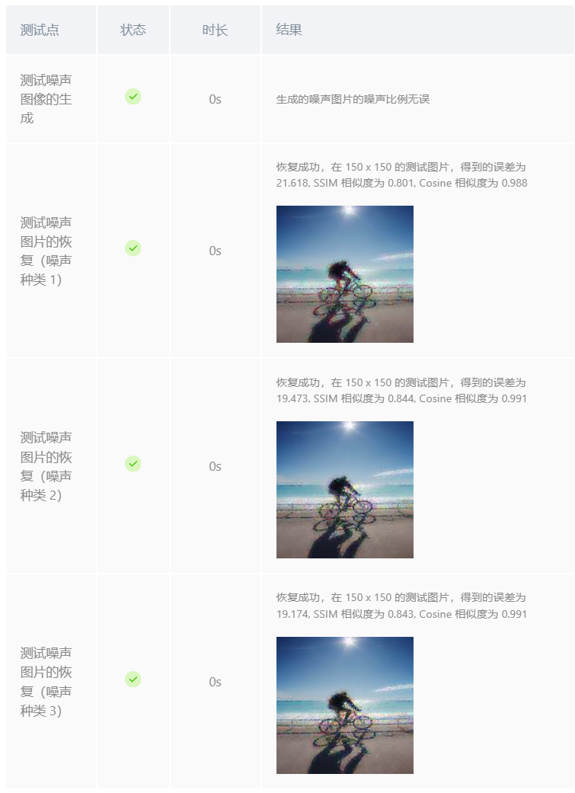
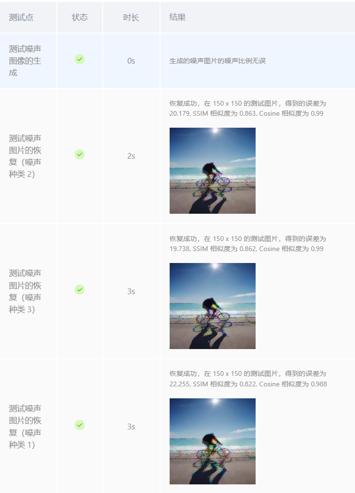
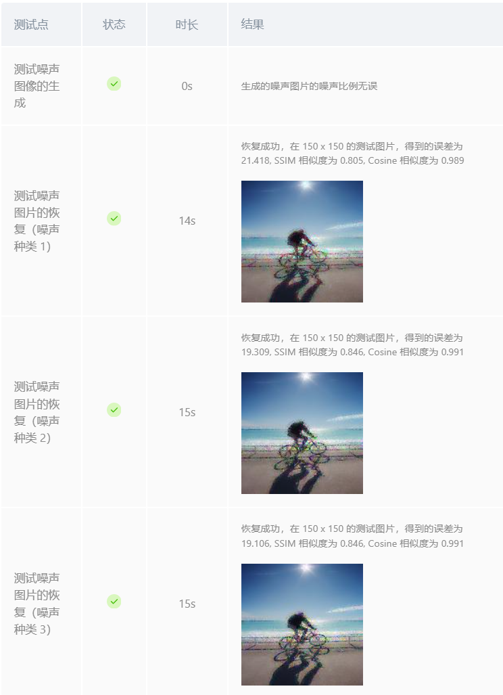

## <center> 图像还原实验报告 </center>


### 一、实验目的
- 了解如何为图像添加噪声
- 了解常见的图像恢复算法，如均值滤波、中值滤波、双边滤波、非局部均值滤波等
- 学习如何采用这些算法进行图像去噪
- 了解图像复原的评价指标，如恢复图像与原始图像二范数之和、SSIM相似度、cosine相似度等

### 二、实验内容
- 生成要求比例的噪声图像
- 采用1种去噪算法对噪声图像进行去噪
- 采取恢复图像与原始图像二范数之和、SSIM相似度、cosine相似度评价去噪效果


### 三、实现过程与具体代码
 **为图片添加噪声：**
 实验要求受损图像是由原始图像添加不同的噪声遮罩得到的，即($\cdot$ 代表逐元素相乘)：
 $$
    \text{受损图像} = \text{原始图像} \cdot \text{噪声遮罩}
 $$

其中，噪声遮罩仅包含{0，1}值，三个通道的噪声比率为0.8,0.4,0.6，即噪声遮罩每个通道每行 80\%,40\%,60\% 的像素值为0，其他为1

按照要求，我们根据比例在每个通道随机生成0元素，噪声遮罩的大小需与原图的长宽保持一致，以便后续计算，代码如下：
```python
height, width, channels = img.shape
noise_masks = []
for ratio in noise_ratio:
    mask = np.random.choice([0, 1], size=(height, width), p=[ratio, 1 - ratio])
    noise_masks.append(mask)
```
再将原图与噪声遮罩逐元素相乘，得到受损图像：
```python
noise_img = np.stack([img[:, :, i] * noise_masks[i] for i in range(channels)], axis=2)
```

**去噪算法：**
在进行去噪的过程中，我最初选择了均值滤波算法和中值滤波算法，但是恢复精度很低（后发现是没有排除邻域中的噪声像素点导致的），然后尝试了线性回归算法，这里给出三种算法的实现过程，效果对比见实验结果与分析：
- 均值滤波：对图像进行均值滤波，即对于每一个噪声像素，使用像素周围邻域的像素的平均值来代替该像素的值（注意应排除邻域中的噪声像素点，否则将影响恢复效果）
代码如下：
    ```python
    res_img = np.copy(noise_img)
    noise_mask = get_noise_mask(noise_img)  # 获取噪声掩码

    height, width, channels = noise_img.shape
    half_size = size // 2

    for c in range(channels):
        for i in range(height):
            for j in range(width):
                if noise_mask[i, j, c] == 0:  # 如果是噪声点
                    # 获取邻域窗口
                    top = max(i - half_size, 0)
                    bottom = min(i + half_size + 1, height)
                    left = max(j - half_size, 0)
                    right = min(j + half_size + 1, width)
                    
                    # 提取窗口内的非噪声像素
                    region = noise_img[top:bottom, left:right, c]
                    mask_region = noise_mask[top:bottom, left:right, c]
                    valid_pixels = region[mask_region == 1]
                    
                    # 计算均值并替换噪声像素
                    if valid_pixels.size > 0:
                        res_img[i, j, c] = np.mean(valid_pixels)
                    else:
                        res_img[i, j, c] = 0.5  # 若无有效像素，设为 0.5（灰色）
    return res_img
    ```


- 中值滤波：对图像进行中值滤波，即对于每一个噪声像素，使用像素周围邻域的像素的中值来代替该像素的值（注意应排除邻域中的噪声像素点，否则将影响恢复效果）
代码只需要将均值滤波中的均值计算改为中值计算即可：
    ```python
    res_img[i, j, c] = np.median(valid_pixels)
    ```
- 线性回归：对于每个噪声像素，使用其周围邻域的像素的坐标值作为自变量，像素点的像素值作为因变量进行线性回归分析，并采用线性回归结果来预测该像素的值（注意应排除邻域中的噪声像素点，否则将影响恢复效果，同时应注意需将线性回归的结果归一到[0,1]内）
代码如下：
    ```python
    res_img = np.copy(noise_img)

    # 获取噪声图像
    noise_mask = get_noise_mask(noise_img)

    # -------------实现图像恢复代码答题区域----------------------------
    
    height, width, channels = noise_img.shape

    # 初始化线性回归模型
    model = LinearRegression()
    #model = Ridge(alpha=0.1)
    # 对每个通道进行处理
    for c in range(channels):
        # 遍历每个像素
        for i in range(height):
            for j in range(width):
                if noise_mask[i, j, c] == 0:  # 如果是噪声点（掩码为 0）
                    # 获取周围区域的边界
                    half_size = size // 2
                    top = max(i - half_size, 0)
                    bottom = min(i + half_size + 1, height)
                    left = max(j - half_size, 0)
                    right = min(j + half_size + 1, width)

                    # 提取周围区域的坐标和像素值
                    region = noise_img[top:bottom, left:right, c]
                    coords = []
                    values = []

                    for x in range(region.shape[0]):
                        for y in range(region.shape[1]):
                            if region[x,y] != 0:
                                coords.append([x+top, y+left])  # 计算全局坐标
                                values.append(region[x, y])

                    coords = np.array(coords)
                    values = np.array(values)

                    # 训练线性回归模型
                    model.fit(coords, values)

                    # 预测当前噪声点的像素值
                    predicted_value = model.predict([[i, j]])[0]

                    #predicted_value = np.clip(predicted_value, 0, 1)
                    if predicted_value > 1:
                        predicted_value = 1
                    if predicted_value < 0:
                        predicted_value = 0

                    # 恢复噪声点
                    res_img[i, j, c] = predicted_value
    ```


### 四、实验结果与分析
- **均值滤波：**
<div align = "center">
<p align="center">均值滤波结果</p >

</div>

- **中值滤波：**
<div align = "center">
<p align="center">中值滤波结果</p >

</div>

- **线性回归：**
<div align = "center">
<p align="center">线性回归结果</p >

</div>

**三种算法对比**：均值滤波计算较为简便，但对于边缘的保留效果较差；中值滤波可有效去除脉冲噪声，对于边缘像素的保留效果也较好，但计算复杂度稍高，且在密集噪声或大窗口下，可能误删细小纹理；线性回归算法采用拟合的方法，可以使恢复的像素值更加平滑且保留细小纹理效果较好，但计算复杂度较高。

从上述结果可以看出，三种图像恢复的效果都很好，SSIM相似度都达到了0.86以上，cosine相似度达到了0.98以上。但是线性回归的精度略高，这是因为线性回归算法可以更好地拟合噪声点的像素值，从而更好地恢复图像。

