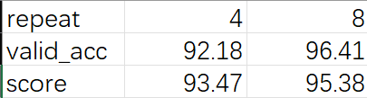

## <center> 垃圾分类实验报告 </center>
### 一、实验目的
- 了解并学习使用Mindspore深度学习框架
- 学习如何在预训练好的模型上进行微调
- 学习如何调整参数以提升深度模型精度


### 二、实验内容
&emsp;&emsp;深度学习计算中，从头开始训练一个实用的模型通常非常耗时，需要大量计算能力。常用的数据如OpenImage、ImageNet、VOC、COCO等公开大型数据集，规模达到几十万甚至超过上百万张。网络和开源社区上通常会提供这些数据集上预训练好的模型。大部分细分领域任务在训练网络模型时，如果不使用预训练模型而从头开始训练网络，不仅耗时，且模型容易陷入局部极小值和过拟合。因此大部分任务都会选择预训练模型，在其上做微调。
&emsp;&emsp;本实验我们基于Mindspore框架，在预训练的MobileNetV2模型上进行微调，实现垃圾分类任务，并通过参数调节提高分类精度。

### 三、实现过程与具体代码
微调的时候需要先冻结backbone的参数，然后提取该层的特征作为Head的输入，这样可以加快训练速度。所以我首先将冻结层在训练集上做一遍推理，然后保存FeatureMap，作为修改层的数据集
```python
def extract_features(net, dataset_path, config):
    if not os.path.exists(config.features_path):
        os.makedirs(config.features_path)
    dataset = create_dataset(config=config)
    step_size = dataset.get_dataset_size()
    if step_size == 0:
        raise ValueError("The step_size of dataset is zero. Check if the images count of train dataset is more \
            than batch_size in config.py")

    data_iter = dataset.create_dict_iterator()
    for i, data in enumerate(data_iter):
        features_path = os.path.join(config.features_path, f"feature_{i}.npy")
        label_path = os.path.join(config.features_path, f"label_{i}.npy")
        if not os.path.exists(features_path) or not os.path.exists(label_path):
            image = data["image"]
            label = data["label"]
            features = net(image)
            np.save(features_path, features.asnumpy())
            np.save(label_path, label.asnumpy())
        print(f"Complete the batch {i+1}/{step_size}")
    return

backbone = MobileNetV2Backbone()
load_checkpoint(config.pretrained_ckpt, net=backbone)
extract_features(backbone, config.dataset_path, config)
```
接下来，我们定义需要训练的Head层网络
```python
class GlobalPooling(nn.Cell):
    def __init__(self, reduction='mean'):
        super(GlobalPooling, self).__init__()
        if reduction == 'max':
            self.mean = ms.ops.ReduceMax(keep_dims=False)
        else:
            self.mean = ms.ops.ReduceMean(keep_dims=False)

    def construct(self, x):
        x = self.mean(x, (2, 3))
        return x


class MobileNetV2Head(nn.Cell):
    def __init__(self, input_channel=1280, hw=7, num_classes=1000, reduction='mean', activation="None"):
        super(MobileNetV2Head, self).__init__()
        self.need_activation = True
        if reduction:
            self.flatten = GlobalPooling(reduction)
        else:
            self.flatten = nn.Flatten()
            input_channel = input_channel * hw * hw
        self.dense = nn.Dense(input_channel, num_classes, weight_init='ones', has_bias=False)
        if activation == "Sigmoid":
            self.activation = nn.Sigmoid()
        elif activation == "Softmax":
            self.activation = nn.Softmax()
        else:
            self.need_activation = False

    def construct(self, x):
        x = self.flatten(x)
        x = self.dense(x)
        if self.need_activation:
            x = self.activation(x)
        return x
```
然后，我们在提取的特征集上训练Head层，首先冻结backbone的参数
```python
def train_head():
    train_dataset = create_dataset(config=config)
    eval_dataset = create_dataset(config=config)
    step_size = train_dataset.get_dataset_size()

    backbone = MobileNetV2Backbone()
    # Freeze parameters of backbone. You can comment these two lines.
    for param in backbone.get_parameters():
        param.requires_grad = False
    load_checkpoint(config.pretrained_ckpt, net=backbone)
```
接下来，我们定义网络结构，损失函数，优化器，训练网络
```python
    head = MobileNetV2Head(input_channel=backbone.out_channels, num_classes=config.num_classes, reduction=config.reduction)
    network = mobilenet_v2(backbone, head)

    loss = nn.SoftmaxCrossEntropyWithLogits(sparse=True, reduction='mean')
    lrs = build_lr(config.epochs * step_size, lr_max=config.lr_max, warmup_steps=0, decay_type=config.decay_type)
    opt = nn.Momentum(head.trainable_params(), lrs, config.momentum, config.weight_decay)
    net = nn.WithLossCell(head, loss)
    train_step = nn.TrainOneStepCell(net, opt)
    train_step.set_train()
```
其中，损失函数我们采用交叉熵损失函数，优化器采用Momentum优化器，学习率采用自定义的学习率调度函数，即学习率随着训练步数的增加而减小，这样能防止训练后期模型产生震荡（我们共实现了两种学习率减小的方法：cosine decay和square decay，其中前者在后期逐渐衰减，而后者在训练前期就有较大衰减，相对均匀）
```python
def build_lr(total_steps, lr_init=0.0, lr_end=0.0, lr_max=0.1, warmup_steps=0, decay_type='cosine'):
    lr_init, lr_end, lr_max = float(lr_init), float(lr_end), float(lr_max)
    decay_steps = total_steps - warmup_steps
    lr_all_steps = []
    inc_per_step = (lr_max - lr_init) / warmup_steps if warmup_steps else 0
    for i in range(total_steps):
        if i < warmup_steps:
            lr = lr_init + inc_per_step * (i + 1)
        else:
            if decay_type == 'cosine':
                cosine_decay = 0.5 * (1 + math.cos(math.pi * (i - warmup_steps) / decay_steps))
                lr = (lr_max - lr_end) * cosine_decay + lr_end
            elif decay_type == 'square':
                frac = 1.0 - float(i - warmup_steps) / (total_steps - warmup_steps)
                lr = (lr_max - lr_end) * (frac * frac) + lr_end
            else:
                lr = lr_max
        lr_all_steps.append(lr)

    return lr_all_steps
```
接着开展 epochs 次训练，记录每次训练时长以及 loss 值，并将中间训练结果进行保存。
```python
# train
history = list()
features_path = config.features_path
idx_list = list(range(step_size))
for epoch in range(config.epochs):
    random.shuffle(idx_list)
    epoch_start = time.time()
    losses = []
    for j in idx_list:
        feature = Tensor(np.load(os.path.join(features_path, f"feature_{j}.npy")))
        label = Tensor(np.load(os.path.join(features_path, f"label_{j}.npy")))
        losses.append(train_step(feature, label).asnumpy())
    epoch_seconds = (time.time() - epoch_start)
    epoch_loss = np.mean(np.array(losses))

    history.append(epoch_loss)
    print("epoch: {}, time cost: {}, avg loss: {}".format(epoch + 1, epoch_seconds, epoch_loss))
    if (epoch + 1) % config.save_ckpt_epochs == 0:
        save_checkpoint(network, os.path.join(config.save_ckpt_path, f"mobilenetv2-{epoch+1}.ckpt"))
```
可以每隔一个固定周期，在训练集上进行一次评估，实时跟踪中间训练模型在训练集上的准确率
```python
    # evaluate
    print('validating the model...')
    eval_model = Model(network, loss, metrics={'acc', 'loss'})
    acc = eval_model.eval(eval_dataset, dataset_sink_mode=False)
    print(acc)
```
由于保存时会保存所有ckpt模型，所以我们需要挑选出准确率最高的模型供测试时使用
```python
acc_values = [item['acc'] for item in acc_list]
CKPT = acc_values.index(max(acc_values))+1
print(acc_values)
print("Max accuracy is ",max(acc_values))
print("Chosen checkpoint is ", CKPT)
```
最终做模型评估时，加载准确率最高的模型并对图像做处理，然后进行分类并测试准确率
```python
backbone = MobileNetV2Backbone()
head = MobileNetV2Head(input_channel=backbone.out_channels, num_classes=config.num_classes, reduction=config.reduction)
network = mobilenet_v2(backbone, head)
model_path = './results/opt_processing/mobilenetv2-28.ckpt'
load_checkpoint(model_path, net=network)

def image_process(image): 
    mean=[0.485*255, 0.456*255, 0.406*255]
    std=[0.229*255, 0.224*255, 0.225*255]
    image = (np.array(image) - mean) / std
    image = image.transpose((2,0,1))
    img_tensor = Tensor(np.array([image], np.float32))
    return img_tensor

def predict(image):
    image = cv2.resize(image,(config.image_height, config.image_width))
    image = image_process(image)
    
    logits = network(image)
    pred = np.argmax(logits.asnumpy(), axis=1)[0]
    
    return inverted[pred]
```

### 四、参数调节与实验结果分析
<div align = "center">

</div>
经过大量的参数调节，最终模型在测试集的准确率接近97%，测试分数为96.92分，效果较好。以下着重分析调参的过程

初次运行直接采用默认参数，在验证集上的精度为51.4%，测试得分也仅有52.3分，效果较差

```python
config = EasyDict({
    "epochs": 10, # 请尝试修改以提升精度
    "lr_max": 0.01, # 请尝试修改以提升精度
    "decay_type": 'constant', # 请尝试修改以提升精度
    "momentum": 0.8, # 请尝试修改以提升精度
    "weight_decay": 3.0, # 请尝试修改以提升精度
})
```
观察参数可以发现，epochs只有10次，模型可能还没有收敛，学习率并未采用动态下降方法，weight_decay的值也较大。因此我们可以通过增加epochs，采用cosine decay或square decay的学习率下降方法，增加momentum的值为0.9或0.99以及降低weight_decay的方法来提升精度。
初步修改得到的参数如下：
```python
config = EasyDict({
    "num_classes": 26, # 分类数，即输出层的维度
    "reduction": 'mean', # mean, max, Head部分池化采用的方式
    "image_height": 224,
    "image_width": 224,
    "batch_size": 32, # 鉴于CPU容器性能，太大可能会导致训练卡住
    "eval_batch_size": 10,
    "epochs": 40, # 请尝试修改以提升精度
    "lr_max": 0.03, # 请尝试修改以提升精度
    "decay_type": 'cosine', # 请尝试修改以提升精度
    "momentum": 0.9, # 请尝试修改以提升精度
    "weight_decay": 4e-5, # 请尝试修改以提升精度
    "dataset_path": "./datasets/5fbdf571c06d3433df85ac65-momodel/garbage_26x100",
    "features_path": "./garbage_26x100_features", # 临时目录，保存冻结层Feature Map，可随时删除
    "class_index": index,
    "save_ckpt_epochs": 1,
    "save_ckpt_path": './results/opt_processing',
    "pretrained_ckpt": './src_mindspore/mobilenetv2-200_1067_cpu_gpu.ckpt',
    "export_path": './results/mobilenetv2.mindir'
})
```
训练得到的模型在验证集的准确率达到93.4%，但测试分数却只有77.69分

<div align = "center">

</div>


之后我们尝试增加mometum为0.99，将学习率下降celve换为square decay，epochs增加到50，修改lr_max为0.1和0.01，测试得到的分数始终在73-78分之间，效果不佳。然后我们观察验证集发现，模型在验证集上的准确率始终在90%以上，但测试精度却不高，有两种可能会导致这种情况，一是模型过拟合，二是测试集和训练集的数据处理方式不同。

接着我们通过对代码的分析，发现了问题：
```python
crop_decode_resize = C.RandomCropDecodeResize(resize_height, scale=(0.08, 1.0), ratio=(0.75, 1.333))
```
在create_dataset函数中，decoder会将图片解码为RGB格式，而在测试函数中，PIL 读取的图片对象是BGR格式，因此我们需要将图片转换为RGB格式，这样才能保证测试集和训练集的数据处理方式一致。
```python
image = cv2.cvtColor(image, cv2.COLOR_BGR2RGB)
```
修改后，在测试集上的分数达到91.54分
<div align = "center">

</div>


在改正这个问题之后，我又尝试了对参数和优化器等进行修改：

**1. 增加epoch** ：将epoch从40增加到60，80，100，发现模型在验证集上的准确率逐渐提升，最高达到96.34%，但在测试集上的得分却始终在90分左右徘徊，这可能是由于过大的epochs导致的学习到了训练集的特异化特征导致准确率有所下降

**2. 将优化器从Momentum改为Adam** ：
```python
opt = nn.Adam(head.trainable_params(), learning_rate=lrs, weight_decay=config.weight_decay)
```
训练得到的模型在验证集上的准确率达到96.6%，相较于之前的momentum有较大提升，测试集上的测试分数为92.24分，相较于原来变化不大。这说明模型的优化器选择对结果的影响很大，我们的优化方向也没有问题，只是受测试数据集的随机性影响导致分数没有提高，预期经过多次训练后是可以达到一个更高的测试分数的。


**3. 修改create_dataset函数**：
```python
crop_decode_resize = C.RandomCropDecodeResize(resize_height, scale=(0.08, 1.0), ratio=(0.75, 1.333))
horizontal_flip_op = C.RandomHorizontalFlip(prob=0.5)
color_adjust = C.RandomColorAdjust(brightness=0.2, contrast=0.01, saturation=0.01)
```
create_dataset函数使用了RandomCropDecodeResize、RandomHorizontalFlip、RandomColorAdjust等函数对数据进行增强，这些函数会对数据进行随机裁剪、翻转和颜色调整等操作，以防止模型学习到训练集的特异化特征。
同时，create_dataset函数还提供了一个repeat参数，用于扩充数据集，默认值为1。于是我尝试了提高repeat的值，以提升模型的泛化能力，不过训练的时间也会随之增加，最终得到的结果如下：
<div align = "center">

</div>
于是最终我们采用上述修改后的超参数和repeat = 8训练的模型，得到了96.92的测试分数，并将模型参数保存在result/best_models文件夹中。
 

