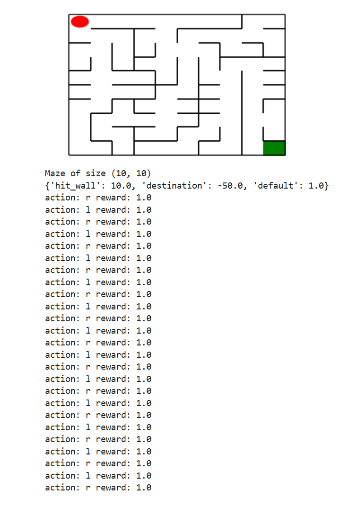

## <center>机器人走迷宫实验报告
### <center> 马涵柘 &emsp;&emsp; 林祖鸿 &emsp;&emsp; 杨志诚 
### 一、实验目的
使用python语言，使用深度优先搜索算法与Deep QLearning算法，完成机器人走迷宫。

1.理解并实现经典图搜索算法——深度优先搜索（DFS）。
2.掌握强化学习中的Deep Q-Learning算法原理与实现方法。
3.对比传统搜索算法与深度强化学习在迷宫问题中的效果与性能差异。
4.培养独立解决问题的能力以及算法在现实问题中的应用能力。


### 二、实验内容
1.迷宫环境搭建
- 使用Python构建迷宫地图（可采用二维数组模拟）。
- 设置起点、终点、障碍物等元素。

2.DFS算法实现
- 使用递归或栈实现深度优先遍历。
- 路径回溯，记录访问路径。
- 输出一条可行路径（非最优）。

3.Deep Q-Learning实现
- 构建状态空间与动作空间。
- 定义奖励函数（如到达终点+400，撞墙-10，每步-1等）。
- 构建神经网络拟合Q值函数。
- 训练智能体在迷宫中自主学习，优化策略。
- 多次训练后，观察路径选择是否趋于稳定与最优。


### 三、实现过程与代码
**创建迷宫：** 利用系统提供的Maze类可以随机创建一个指定大小的迷宫(其中maze_size为迷宫大小)，利用print函数可以输出迷宫的size以及画出迷宫图
```python
from Maze import Maze
maze = Maze(maze_size=10) # 随机生成迷宫
```
<br>

**基础算法实现：** 我们选用了**深度优先搜索算法**作为迷宫的寻路算法，DFS算法的基本思路是：从起点出发，沿着一条路径向前走，直到走到死胡同为止，然后回溯到上一个节点，继续沿着另一条路径向前走，直到找到终点为止。这刚好对应栈的特性：后进先出，于是我们使用栈来实现深度优先搜索算法。

首先我们引用了SearchTree 类，用于表示搜索树的节点。每个节点包含以下属性：
- loc：当前节点的位置
- to_this_action：到达当前节点的动作
- parent：当前节点的父节点
- children：当前节点的子节点列表
```python
class SearchTree(object):
    def __init__(self, loc=(), action='', parent=None):
        self.loc = loc  # 当前节点位置
        self.to_this_action = action  # 到达当前节点的动作
        self.parent = parent  # 当前节点的父节点
        self.children = []  # 当前节点的子节点

    def add_child(self, child):
        self.children.append(child)

    def is_leaf(self):
        return len(self.children) == 0
```
接着我们定义了**expand函数和back_propagation函数**。

其中expand函数用于拓展当前节点，生成所有可能的子节点。该函数的基本思路是首先获取当前节点可以移动的方向。然后对于每个可以移动的方向，计算新位置。最后如果新位置未被访问过，则创建一个新的 SearchTree 节点，并将其添加到当前节点的子节点列表中

back_propagation函数用于从目标节点回溯到起始节点，记录路径。该函数的基本思路是先从目标节点开始，沿着父节点回溯，直到到达起始节点，然后将路径中的每个动作记录下来，并按顺序返回


```python
def expand(maze, is_visit_m, node):
    can_move = maze.can_move_actions(node.loc)
    for a in can_move:
        new_loc = tuple(node.loc[i] + move_map[a][i] for i in range(2))
        if not is_visit_m[new_loc]:
            child = SearchTree(loc=new_loc, action=a, parent=node)
            node.add_child(child)


def back_propagation(node):
    path = []
    while node.parent is not None:
        path.insert(0, node.to_this_action)
        node = node.parent
    return path
```
然后我们实现了深度优先搜索算法的**核心函数my_search**。该函数的基本思路为首先获取机器人当前位置作为搜索树的根节点，并使用栈结构存储待探索的节点。算法维护一个与迷宫大小相同的访问矩阵，记录每个位置是否被访问过。每次从栈中取出当前节点，标记为已访问；若该节点位置为终点，则调用回溯函数重建路径并结束搜索；若当前节点为叶节点，则调用扩展函数生成其所有可行的子节点（未被访问的相邻位置）；这些子节点被逆序压入栈中，确保深度优先地继续探索。整个过程持续进行，直到找到通向终点的路径或栈为空为止
```python
def my_search(maze):
    start = maze.sense_robot()
    root = SearchTree(loc=start)
    stack = [root] 
    h, w, _ = maze.maze_data.shape
    is_visit_m = np.zeros((h, w), dtype=np.int)  
    path = []  

    while stack:
        current_node = stack.pop() 
        is_visit_m[current_node.loc] = 1  

        if current_node.loc == maze.destination:  
            path = back_propagation(current_node)
            break

        if current_node.is_leaf():
            expand(maze, is_visit_m, current_node)

        # 将子节点按逆序压入栈中
        for child in reversed(current_node.children):
            stack.append(child)
    return path
```
<br>

**强化学习算法：** 我们选用了deep Q-learning算法作为迷宫的寻路算法，DQN算法的基本思路是：通过神经网络来近似Q-learning算法中的Q值函数，从而实现对动作价值的估计。因此要了解deep Q-learning算法，首先需要了解Q-learning算法。
**Q-Learning** 是一个**值迭代算法**。与策略迭代算法不同，值迭代算法会计算每个”状态“或是”状态-动作“的值或是效用，然后在执行动作的时候，会设法最大化这个值。

在实际的执行过程中，Q-learning 算法将状态和动作构建成一张 Q_table 表来存储 Q 值，Q 表的行代表状态，列代表动作，表格中的每个元素代表在某个状态下执行某个动作的价值。Q-learning 算法的核心思想是通过不断地更新 Q 表来学习最优策略。具体来说，Q-learning 算法会根据当前状态和动作的 Q 值来计算一个新的 Q 值，然后将这个新值更新到 Q 表中。这个新值是通过以下公式计算的：
$$
 Q(s,a) = (1-\alpha)Q(s,a) + \alpha [r + \gamma \max_{a} Q(s',a)]
$$
其中 $r$代表对于当前的状态s，执行动作a后，获得的环境奖励，$ \max_{a} Q(s',a)$表示执行动作a到达下一个状态s'后，所有可能的动作中Q值最大的动作，$\gamma$是折扣因子。$\alpha$是松弛因子，目的是使得的Q值更平滑。

然而，在初步的学习中，Q 值是不准确的，如果在这个时候都按照 Q 值来选择，那么会造成错误，而且在学习一段时间后，机器人的路线会相对固定，则机器人无法对环境进行有效的探索。

为了解决这个问题，我们需要在选择动作时引入一定的随机性。我们可以使用 $\epsilon$-greedy 策略来平衡探索和利用：以 $\epsilon$ 的概率随机选择一个动作，以 $1-\epsilon$ 的概率选择当前 Q 值最大的动作。随着训练的进行，$\epsilon$ 会逐渐减小，从而使得机器人在初期能够探索更多的状态，而在后期则能够更好地利用已经学到的知识。

**Deep Q-Learning算法**在Q-learning算法的基础上，使用深度神经网络来近似 Q 值函数。随着迷宫规模的增大，Q 表的大小也会随之增大，导致 Q 表的存储和更新变得非常困难。因此，我们使用深度神经网络来近似 Q 值函数，目标是通过训练网络，让它输出每个动作在当前状态下的 Q 值，从而选择最优动作
$$
    \begin{align*}
             Q(s,a,\theta)  \approx Q(s,a) \\
     a = \arg\max_{a} Q(s,a,\theta) \\
    \end{align*}
$$
为了解决训练不稳定、收敛困难等问题，DQN 引入了以下两个核心机制:
- 经验回放：将智能体的 $(s,a,r,s')$存储到一个经验池中，每次训练时从中随机采样小批量数据，从而打破数据之间的相关性，提高训练的稳定性。
- 目标网络：使用两个神经网络，一个是当前网络Q(s,a,θ)，另一个是目标网络Q(s,a,θ')，目标网络的参数每隔一段时间从当前网络拷贝，用于计算目标 Q 值。这样可以避免 Q 值的快速变化导致训练不稳定。
$$
    Q = r + \gamma \max_{a} Q(s',a,\theta') \\
$$

实际的训练流程是按照下图进行的：
<div align = "center">

</div>

- 初始化Q网络和目标网络的参数，初始化经验池
- 在每一个时间步，执行以下操作：
    - 选择动作：根据当前状态s和Q网络的参数θ，使用$\epsilon$-greedy策略选择动作a。
    - 执行动作：在环境中执行动作a，获得奖励r和下一个状态s'。
    - 存储经验：将$(s,a,r,s')$存储到经验池中。
    - 采样经验：从经验池中随机采样小批量数据$(s,a,r,s')$。
    - 更新Q网络：使用小批量数据计算目标 Q 值，最小化均方误差损失并更新 Q 网络的参数θ。
    - 更新目标网络：每隔若干步，将当前网络的参数θ拷贝到目标网络的参数θ'。
 
示例的代码中已经提供了QRobot类和Runner类，其中QRobot类实现了Q表迭代和机器人动作的选择策略，Runner类用于机器人的训练（即不断迭代更新Q值）和可视化

我们自己定义的DQNRobot继承了QRobot类，参考了示例代码中提供的MinDQNRobot，在__init__函数中初始化了一些参数，同时额外实现了神经网络的定义，训练函数和参数更新函数，在实际训练过程中，我们调用runner类的train函数来进行训练，train函数会不断调用Robot类中的train_update函数来进行参数更新。具体代码如下：
```python
class Robot(QRobot):

    valid_action = ['u', 'r', 'd', 'l']

    ''' QLearning parameters'''
    epsilon0 = 0.5  # 初始贪心算法探索概率
    gamma = 0.94  # 公式中的 γ

    EveryUpdate = 1  # the interval of target model's updating

    """some parameters of neural network"""
    target_model = None
    eval_model = None
    batch_size = 32
    learning_rate = 1e-2
    TAU = 1e-3
    step = 1  # 记录训练的步数

    """setting the device to train network"""
    device = torch.device("cuda:0") if torch.cuda.is_available() else torch.device("cpu")

    def __init__(self, maze):
        """
        初始化 Robot 类
        :param maze:迷宫对象
        """
        super(Robot, self).__init__(maze)
        maze.set_reward(reward={
            "hit_wall": 10.,
            "destination": -maze.maze_size ** 2 * 5.,
            "default": 1.,
        })
        self.maze = maze
        self.epsilon = 0
        self.maze_size = maze.maze_size

        """build network"""
        self.target_model = None
        self.eval_model = None
        self._build_network()

        """create the memory to store data"""
        max_size = max(self.maze_size ** 2 * 3, 1e4)
        self.memory = ReplayDataSet(max_size=max_size)

        """开启金手指，获取全图视野"""
        self.memory.build_full_view(maze=maze)
        self.loss_list = self.train()
        
    def _build_network(self):
        seed = 0
        random.seed(seed)

        """build target model"""
        self.target_model = QNetwork(state_size=2, action_size=4, seed=seed).to(self.device)

        """build eval model"""
        self.eval_model = QNetwork(state_size=2, action_size=4, seed=seed).to(self.device)

        """build the optimizer"""
        self.optimizer = optim.Adam(self.eval_model.parameters(), lr=self.learning_rate)

    def target_replace_op(self):
        """
            Soft update the target model parameters.
            θ_target = τ*θ_local + (1 - τ)*θ_target
        """
        """ replace the whole parameters"""
        self.target_model.load_state_dict(self.eval_model.state_dict())

    def _choose_action(self, state):
        state = np.array(state)
        state = torch.from_numpy(state).float().to(self.device)
        if random.random() < self.epsilon:
            action = random.choice(self.valid_action)
        else:
            self.eval_model.eval()
            with torch.no_grad():
                q_next = self.eval_model(state).cpu().data.numpy()  # use target model choose action
            self.eval_model.train()

            action = self.valid_action[np.argmin(q_next).item()]
        return action

    def _learn(self, batch: int = 16):
        if len(self.memory) < batch:
            print("the memory data is not enough")
            return
        state, action_index, reward, next_state, is_terminal = self.memory.random_sample(batch)

        """ convert the data to tensor type"""
        state = torch.from_numpy(state).float().to(self.device)
        action_index = torch.from_numpy(action_index).long().to(self.device)
        reward = torch.from_numpy(reward).float().to(self.device)
        next_state = torch.from_numpy(next_state).float().to(self.device)
        is_terminal = torch.from_numpy(is_terminal).int().to(self.device)

        self.eval_model.train()
        self.target_model.eval()

        """Get max predicted Q values (for next states) from target model"""
        Q_targets_next = self.target_model(next_state).detach().min(1)[0].unsqueeze(1)

        """Compute Q targets for current states"""
        Q_targets = reward + self.gamma * Q_targets_next * (torch.ones_like(is_terminal) - is_terminal)

        """Get expected Q values from local model"""
        self.optimizer.zero_grad()
        Q_expected = self.eval_model(state).gather(dim=1, index=action_index)

        """Compute loss"""
        loss = F.mse_loss(Q_expected, Q_targets)
        loss_item = loss.item()

        """ Minimize the loss"""
        loss.backward()
        self.optimizer.step()

        """copy the weights of eval_model to the target_model"""
        self.target_replace_op()
        return loss_item
    def train(self):
        loss_list = []
        batch_size = len(self.memory)
        
        # 训练，直到能走出这个迷宫
        while True:
            loss = self._learn(batch=batch_size)
            loss_list.append(loss)
            success = False
            self.reset()
            for _ in range(self.maze.maze_size ** 2 - 1):
                a, r = self.test_update()
            #     print("action:", a, "reward:", r)
                if r == self.maze.reward["destination"]:
                    return loss_list
            
    def train_update(self):
        state = self.sense_state()
        action = self._choose_action(state)
        reward = self.maze.move_robot(action)
        return action, reward
    
    def test_update(self):
        state = np.array(self.sense_state(), dtype=np.int16)
        state = torch.from_numpy(state).float().to(self.device)

        self.eval_model.eval()
        with torch.no_grad():
            q_value = self.eval_model(state).cpu().data.numpy()

        action = self.valid_action[np.argmin(q_value).item()]
        reward = self.maze.move_robot(action)
        return action, reward
```

### 四、实验结果与分析
**dfs算法结果：** 首先我们对基础搜索算法dfs进行测试，实验结果表明，对于20*20的迷宫，DFS算法能够在较短的时间（1s内）找到一条可行路径。

<div align = "center">

</div>

**DQN算法结果：** 
接着我们对深度强化学习算法DQN进行测试，实验结果表明，当迷宫规模较小时（如5×5时），DQN算法可以找到一条可行路径，但在迷宫规模较大时（如10×10时），DQN算法往往陷入重复的循环中，无法找到一条可行路径。
<div style="display: flex; justify-content: center;">
  
  
</div>

起初我们认为是训练次数epoch=10太小导致的，但当我们将epoch增大到50，100时，仍然会陷入左右或上下原地踏步的循环中，于是我们继续对代码进行分析与调试，发现了两个可能原因：
- 奖励函数中对目标点的奖励设置过低，只有-50，而撞墙的惩罚设置过高，达到10，所以，机器人学习到的策略可能是：不要撞墙就好，其他都差不多，但不会强烈趋向目标，所以就会陷入原地踏步的死循环中
- 前期的动作基本是随机乱走，经验池质量较差以及经验同质化严重，全是“撞墙”、“兜圈子”数据，模型学不到什么策略，这就导致了Q网络学不到正确方向，陷入局部最优甚至死循环。

针对这两个问题，我们进行了如下修改：

首先我们将目标函数的奖励设置为随迷宫的大小而变化，这样当迷宫规模扩大时，目标点的奖励也会相应增大，从而使得机器人更倾向于朝着目标点移动。
```python
maze.set_reward(reward={
            "hit_wall": 10.,
            "destination": -maze.maze_size ** 2 * 4.,
            "default": 1.,
        })
```  
然后，我们在创建robot实例时加入预训练函数，强制 DQN 至少找到过一次成功路径，reward["destination"] 被引入经验池，这样模型参数已经能“部分感知”奖励更大的路径方向，后续训练的 ε-greedy 才能探索到更有价值的动作      
```python
def train(self):
    loss_list = []
    batch_size = len(self.memory)
    
    # 训练，直到能走出这个迷宫
    while True:
        loss = self._learn(batch=batch_size)
        loss_list.append(loss)
        success = False
        self.reset()
        for _ in range(self.maze.maze_size ** 2 - 1):
            a, r = self.test_update()
        #     print("action:", a, "reward:", r)
            if r == self.maze.reward["destination"]:
                return loss_list
```
修改完后，我们对10×10的迷宫进行测试，发现DQN算法能够稳定地找到一条可行路径。

<div align = "center">

</div>
最后我们进行系统测试，结果表明对于3×3，5×5，11×11的迷宫，DQN算法都能够找到一条可行路径。
<div align = "center">

</div>

<div align = "center">

</div>

<div align = "center">

</div>

<div align = "center">

</div>


### 五、实验总结
本次实验通过将传统的深度优先搜索算法与现代的Deep Q-Learning深度强化学习算法相结合，对比分析了它们在迷宫导航任务中的表现与适用性。DFS提供了一个基础、确定性强但灵活性不足的路径搜索方法，而Deep Q-Learning则展示了强大的自适应能力和学习能力，尤其在复杂环境下具有显著优势。

通过动手实现这两种算法，不仅加深了我们对路径规划问题求解策略的理解，也锻炼了我们在实际工程中调试、建模和优化算法的能力。实验进一步让我们认识到，虽然强化学习在训练初期可能面临探索不足或收敛困难等挑战，但其最终表现出的智能决策能力为今后机器人自主导航技术的研究与应用提供了重要方向。


