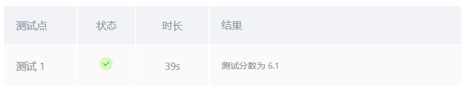
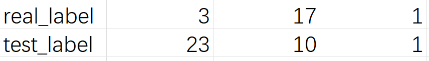
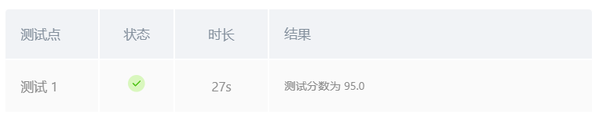
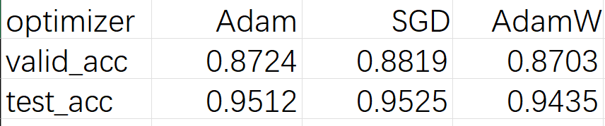
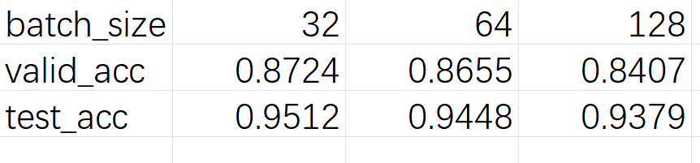
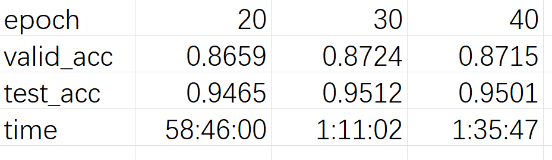

## <center> 路标识别实验报告 </center>
### 一、实验目的
- 学习掌握适用于路标识别的深度学习模型（如resnet10，resnet18等）
- 学习并用pytorch实现残差神经网络模型以用于训练
- 学习如何调整参数以提升深度模型精度
  
### 二、实验内容
&emsp;&emsp;本实验我们使用GTSRB数据集进行路标识别，数据集包含43类路标和超过50000张图片，物品都是放在白板上在日光/室内光源下拍摄的，压缩后的尺寸为 512 * 384。我们需要使用pytorch框架搭建一个resnet18模型并完成数据处理与训练的部分，最终在测试集上验证模型识别路标的准确率

### 三、实现过程与具体代码
由于GTSRB数据集挂载的数据较为凌乱，在划分训练和验证集之前，我们需要进行数据整理，即只将原数据集中train中的数据拷贝到新建的文件夹data下,代码如下：
```python
import os
import shutil

# 创建目标目录
if not os.path.exists("data"):
    os.makedirs("data")
    print("目录 'data' 已创建。")
else:
    print("目录 'data' 已存在。")

# 复制文件夹内容
src_path = "./datasets/meowmeowmeowmeowmeow-gtsrb-german-traffic-sign-momodel/train"
dst_path = "./data/train_images"

if os.path.exists(src_path):
    if not os.path.exists(dst_path):
        shutil.copytree(src_path, dst_path)
        print(f"已成功将 {src_path} 的内容复制到 {dst_path}。")
    else:
        print(f"目标目录 {dst_path} 已存在，跳过复制。")
else:
    print(f"源路径 {src_path} 不存在，请检查路径。")
```
整理好数据后，我们将数据集划分为训练集和验证集。其中每个图片的前6位数字代表了其所属的类别，中间6位表示组数，我们将每类图片的前三组划分为验证集，其余的图片划分为训练集。代码如下：
```python
def initialize_data(folder):
    # make validation_data by using images 00000*, 00001* and 00002* in each class
    train_folder = folder + '/train_images'
    val_folder = folder + '/val_images'
    if not os.path.isdir(val_folder):
        print(val_folder + ' not found, making a validation set')
        os.mkdir(val_folder)
        for dirs in os.listdir(train_folder):
            os.mkdir(val_folder + '/' + dirs)
            for f in os.listdir(train_folder + '/' + dirs):
                if f[6:11]==('00000') or f[6:11]==('00001') or f[6:11]==('00002'):
                    # move file to validation folder
                    os.rename(train_folder + '/' + dirs + '/' + f, val_folder + '/' + dirs + '/' + f)
```
接下来，我们对数据进行增强处理,包括裁剪、随机旋转、随机水平翻转、颜色抖动归一化等。这样做的目的是为了增强训练数据的随机性，防止模型学习到特异化特征导致过拟合。然后我们使用dataLoader加载数据集，方便后续的训练和验证。代码如下：

```python
def processing_data(data_path):
    transform = transforms.Compose([
        transforms.Resize((64, 64)),
        transforms.RandomRotation(15),
        transforms.RandomHorizontalFlip(),
        transforms.ColorJitter(brightness=0.5, contrast=0.5, saturation=0.5, hue=0.2),
        transforms.ToTensor(),
        transforms.Normalize((0.5,), (0.5,))
    ])
    
    train_dataset = datasets.ImageFolder(root=os.path.join(data_path, 'train_images'), transform=transform)
    test_dataset = datasets.ImageFolder(root=os.path.join(data_path, 'val_images'), transform=transform)
    
    train_loader = data.DataLoader(train_dataset, batch_size=32, shuffle=True)
    test_loader = data.DataLoader(test_dataset, batch_size=32, shuffle=False)
    
    return train_loader, test_loader
```

在处理完数据之后，我们需要依靠pytorch框架搭建一个resnet18模型。ResNet18 是 ResNet家族中的一种轻量级卷积神经网络，主要用于图像分类任务。它通过引入残差连接 $y = F(x) + x$来解决深度网络训练中的梯度消失和爆炸问题，从而使得网络可以更深。ResNet18 由18层深度的卷积层组成，包含了一个conv1卷积层，4个残差块和一个全连接层。每个残差块由两个3x3的卷积层，一个shortcut连接以及一个激活函数组成。借助pytorch框架，我们可以很方便地实现ResNet18模型。代码如下：
```python
class BasicBlock(nn.Module):
    def __init__(self, in_channels, out_channels, stride=1):
        super(BasicBlock, self).__init__()
        self.conv1 = nn.Conv2d(in_channels, out_channels, kernel_size=3, stride=stride, padding=1, bias=False)
        self.bn1 = nn.BatchNorm2d(out_channels)
        self.relu = nn.ReLU(inplace=True)
        self.conv2 = nn.Conv2d(out_channels, out_channels, kernel_size=3, stride=1, padding=1, bias=False)
        self.bn2 = nn.BatchNorm2d(out_channels)
        self.downsample = None
        if stride != 1 or in_channels != out_channels:
            self.downsample = nn.Sequential(
                nn.Conv2d(in_channels, out_channels, kernel_size=1, stride=stride, bias=False),
                nn.BatchNorm2d(out_channels)
            )
    
    def forward(self, x):
        identity = x
        if self.downsample is not None:
            identity = self.downsample(x)
        out = self.conv1(x)
        out = self.bn1(out)
        out = self.relu(out)
        out = self.conv2(out)
        out = self.bn2(out)
        out += identity
        out = self.relu(out)
        return out

class ResNet18(nn.Module):
    def __init__(self, num_classes):
        super(ResNet18, self).__init__()
        self.conv1 = nn.Conv2d(3, 64, kernel_size=7, stride=2, padding=3, bias=False)
        self.bn1 = nn.BatchNorm2d(64)
        self.relu = nn.ReLU(inplace=True)
        self.maxpool = nn.MaxPool2d(kernel_size=3, stride=2, padding=1)
        self.layer1 = self._make_layer(64, 64, 2)
        self.layer2 = self._make_layer(64, 128, 2, stride=2)
        self.layer3 = self._make_layer(128, 256, 2, stride=2)
        self.layer4 = self._make_layer(256, 512, 2, stride=2)
        self.avgpool = nn.AdaptiveAvgPool2d((1, 1))
        self.fc = nn.Linear(512, num_classes)
    
    def _make_layer(self, in_channels, out_channels, blocks, stride=1):
        layers = []
        layers.append(BasicBlock(in_channels, out_channels, stride))
        for _ in range(1, blocks):
            layers.append(BasicBlock(out_channels, out_channels))
        return nn.Sequential(*layers)
    
    def forward(self, x):
        x = self.conv1(x)
        x = self.bn1(x)
        x = self.relu(x)
        x = self.maxpool(x)
        x = self.layer1(x)
        x = self.layer2(x)
        x = self.layer3(x)
        x = self.layer4(x)
        x = self.avgpool(x)
        x = torch.flatten(x, 1)
        x = self.fc(x)
        return x
```
在搭建好模型后，我们需要对模型进行训练，训练的目的是通过不断迭代，使模型的预测结果与真实结果之间的误差不断减小，从而提高模型的预测精度。在每次迭代过程中，我们先初始化梯度，然后将自变量输入模型得到输出，再计算模型的输出和真实的输出之间的损失，接着计算每个参数相对于损失的梯度，最后将参数沿着梯度的方向以学习率为步长进行更新。在训练过程中，我们需要定义损失函数和优化器，损失函数用于衡量模型的预测结果与真实结果之间的差距，优化器用于调整模型的参数，使损失函数最小化。在本次实验中，我们采用了交叉熵损失函数和Adam优化器。
```python
def model(train_data, save_model_path):
    device = torch.device("cuda" if torch.cuda.is_available() else "cpu")
    model = ResNet18(num_classes=len(train_data.dataset.classes)).to(device)
    print("the number of classes:",len(train_data.dataset.classes))
    criterion = nn.CrossEntropyLoss()
    optimizer = optim.Adam(model.parameters(), lr=0.001)
    
    epochs = 40
    for epoch in range(epochs):
        model.train()
        running_loss = 0.0
        for images, labels in train_data:
            images, labels = images.to(device), labels.to(device)
            optimizer.zero_grad()
            outputs = model(images)
            loss = criterion(outputs, labels)
            loss.backward()
            optimizer.step()
            running_loss += loss.item()
        
        print(f"Epoch {epoch+1}/{epochs}, Loss: {running_loss/len(train_data):.4f}")
    
    torch.save(model.state_dict(), save_model_path)
    return model
```
得到训练好的模型之后，我们对模型进行评估，评估的目的是通过对模型在验证集上的预测结果进行分析，来判断模型的性能和准确率。在评估过程中，我们需要将验证集中的每个样本输入模型，得到模型的预测结果，然后将预测结果与真实结果进行比较，计算模型的准确率。
```python
def evaluate_mode(test_data, save_model_path):
    device = torch.device("cuda" if torch.cuda.is_available() else "cpu")
    model = ResNet18(num_classes=len(test_data.dataset.classes))
    model.load_state_dict(torch.load(save_model_path))
    model = model.to(device)
    model.eval()
    
    all_preds = []
    all_labels = []
    with torch.no_grad():
        for images, labels in test_data:
            images, labels = images.to(device), labels.to(device)
            outputs = model(images)
            _, preds = torch.max(outputs, 1)
            all_preds.extend(preds.cpu().numpy())
            all_labels.extend(labels.cpu().numpy())
    
    acc = accuracy_score(all_labels, all_preds)
    print(f"Test Accuracy: {acc:.4f}")
```
最终，我们将在验证集上预测准确率较高的模型在测试集上进行预测，预测的方法与验证一致，只需加载训练得到的模型的参数，然后将验证集替换为测试集即可（注意验证和测试时图片只需做裁剪和归一化操作，无需进行旋转，水平翻转等）。代码如下：
```python
def predict(img):
    # 获取图片的类别
    # 把图片转换成为tensor
    if isinstance(img, str):
        img = Image.open(img).convert("RGB")
    if not isinstance(img, Image.Image):
        raise TypeError(f"img should be PIL Image. Got {type(img)}")

    
    transform = transforms.Compose([
        transforms.Resize((64, 64)),
        transforms.ToTensor(),
        transforms.Normalize((0.5,), (0.5,))
    ])
    
    img = transform(img).unsqueeze(0).to(device)
    with torch.no_grad():
        output = model(img)
        _, predicted = torch.max(output, 1)
        
    index_list = [0,1,10,11,12,13,14,15,16,17,18,19,2,20,21,22,23,24,25,26,27,28,29,3,30,31,32,33,34,35,36,37,38,39,4,40,41,42,5,6,7,8,9]
    predict_index = predicted.item()
    y_predict = index_list[predict_index]
```
### 四、实验结果与调参分析
在本次实验中，影响模型准确率的主要因素包括优化器的选择，epoch参数，学习率参数，batch_size等，最初选择Adam优化器，学习率为0.001，batch_size为32，epoch为40，在验证集上的精度达到88.75%，但测试分数只有6.1分
<div align = "center">

</div>
之后我对学习率，epoch和batch_size进行了修改，验证集的精度始终在90%以上，但测试的分数始终不高于7分，这么低的分数表明了模型的输出与真实值之间的差距较大，但模型在验证集上的精度却很高，这说明模型的性能是没有问题的可能是测试时输出形式的问题，于是我输出了几张图片的预测结果，结果如下：
<div align = "center">

</div>

发现预测得到的标签与真实标签确实差异较大，经过分析发现测试集的标签并不是按照0，1，2，3，4...的顺序排列的，而是按照0，1，10，11，12...的顺序排列的，我们返回的label其实是该图片的label在测试集的label中的索引值，而不是该图片的真实标签。因此我们需要建立索引表，将测试集的标签转换为真实标签。
```python
index_list = [0,1,10,11,12,13,14,15,16,17,18,19,2,20,21,22,23,24,25,26,27,28,29,3,30,31,32,33,34,35,36,37,38,39,4,40,41,42,5,6,7,8,9]
predict_index = predicted.item()
y_predict = index_list[predict_index]
```
修改后，测试的分数达到95分
<div align = "center">

</div>


接下来，我们继续对参数进行调节，并分析参数改变对预测准确率的影响
**1. 优化器**
我们在epoch = 30，batch_size = 32时，分别使用SGD，Adam和AdamW优化器进行优化，得到验证精度和预测精度如下：
<div align = "center">

</div>
可以看出，优化器对准确率的影响并不大，三种优化器的预测精度都在95%左右，AdamW优化器的测试精度略低，可能是AdamW优化器的正则化项导致了小规模样本的过拟合

**2. batch_size**
当epoch = 30，优化器为Adam时，我们将batch_size设置为32，64，128进行训练，得到验证精度和预测精度如下：
<div align = "center">

</div>
可以看出，batch_size越大，训练速度越快，但验证精度和测试精度却有所下降，可能是batch_size过大导致了参数的更新不够频繁，模型的泛化能力下降。同时，batch_size过大也会过多的占用显存，因此我们选择较小的batch_size训练效果更佳。

**3.epoch**
当优化器为Adam，batch_size = 32时，我们将epoch设置为20，30，40进行训练，得到验证精度和预测精度如下：

<div align = "center">

</div>
从上述数据可以看出，epoch越大，训练速度越慢，但验证精度和测试精度却有所提升，不过40的epoch却比30的epoch精度略低，这可能是由于训练次数过多导致模型学习到了特异化的特征，泛化能力下降，我猜测高于40的epoch精度会进一步降低，但由于GPU使用时长有限而无法验证
